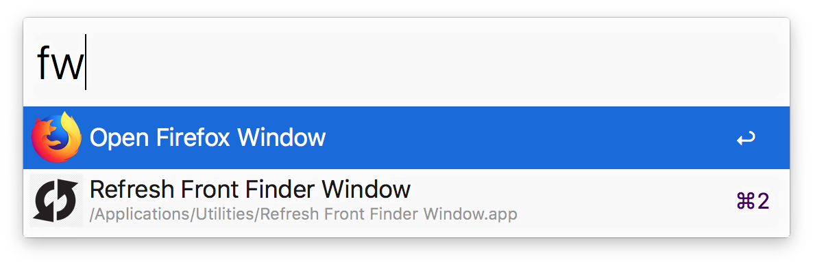

# Alfred new Firefox window workflow

Type `fw` to open a new Firefox window on the current desktop.

<a href="./firefox-window.alfredworkflow?raw=true">Download</a>

---

[caiogondim.com](https://caiogondim.com) &nbsp;&middot;&nbsp;
GitHub [@caiogondim](https://github.com/caiogondim) &nbsp;&middot;&nbsp;
Twitter [@caio_gondim](https://twitter.com/caio_gondim)
